- [版权声明](#版权声明)
- [更适合大学生的硬件选择导论](#更适合大学生的硬件选择导论)
  - [适合随时随地阅读的计算机组成原理基础](#适合随时随地阅读的计算机组成原理基础)
    - [什么是个人计算机](#什么是个人计算机)
    - [什么是一台完整的个人计算机（PC）主机](#什么是一台完整的个人计算机pc主机)
    - [CPU](#cpu)
    - [内存](#内存)
    - [PCIe 扩展设备](#pcie-扩展设备)
      - [PCIe 总线](#pcie-总线)
      - [显卡](#显卡)
      - [NVMe M.2 硬盘](#nvme-m2-硬盘)
    - [南桥](#南桥)
    - [CPU 散热器](#cpu-散热器)
    - [机箱、机箱风扇与电源](#机箱机箱风扇与电源)
  - [DIY PC 硬件选择原理与方法](#diy-pc-硬件选择原理与方法)
    - [论 U 显平衡](#论-u-显平衡)
    - [A or I? N or A？](#a-or-i-n-or-a)
    - [我需要为电脑购买多大的电源（PSU）？](#我需要为电脑购买多大的电源psu)
    - [我需要买什么样的主板？](#我需要买什么样的主板)
    - [如何从头开始选择自己的组装电脑配置？](#如何从头开始选择自己的组装电脑配置)
  - [结语](#结语)

# 版权声明

本作品适用 Creative Commons Attribution 4.0 International License 版权协议。  
This file is licensed under the Creative Commons Attribution 4.0 International license.

LICENSED BY: CC-BY-NC-SA

**您可以做的**

1. 您（用户）可以复制、发行、展览、表演、放映、广播或通过信息网络传播本作品；您必须按照作者或者许可人指定的方式对作品进行署名
2. 您可以自由复制、散布、展示及演出本作品；若您改变、转变或更改本作品，仅在遵守与本作品相同的许可条款下，您才能散布由本作品产生的派生作品

**您需要遵守的**

1. 您不得为商业目的而使用本作品
2. 署名必须包含“最大限度的信息”。 一般来说，这意味着：

- 包含任何版权声明（如适用）。如果作品自身带有作者的版权声明，版权声明必须保持不变，或在一种合理的方式下重新分发给媒介
- 引用作者的名字，网名或用户 ID 等。如果作品发布在互联网上，如果存在作者的个人档案页面，应附上页面的链接
- 引用作品的标题或名称（如适用），前提是存在标题或名称。如果作品发布在互联网上，应在重新分发时连接到原作品的标题或者名称
- 引用作品的 CC 许可协议。如果作品发布在互联网上，应引用作者的 CC 许可协议，且应附有到 CC 网站的链接
- 如果作品是一个派生作品或改编作品，除了以上几点外，还应该说明这是一个派生作品

如果对该协议含义或细节产生疑问，请访问  
https://creativecommons.org/licenses/by-nc-sa/4.0/legalcode  
如果您访问该网站时遇到困难，也可以访问  
https://blog.csdn.net/jiangyu1013/article/details/80649774

---

# 更适合大学生的硬件选择导论

如何选择适合自己预算的处理器/显卡？如何为自组整机搭配其他配件？

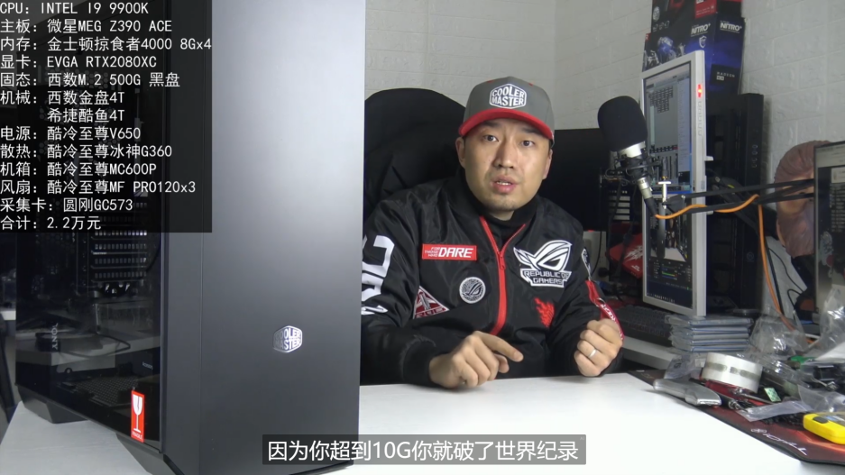

## 适合随时随地阅读的计算机组成原理基础

### 什么是个人计算机

个人计算机的概念诞生于超大规模集成电路发展的年代，第一代光刻蚀工艺的发展使得 CPU 的制程开始向纳米级别靠近，在甚至不如计算机起步阶段一个真空管面积的核心上，可以制造天文数字的逻辑门电路，并且达到远超过电子管与晶体管计算机的性能。同时，磁带、机械硬盘与光盘等存储技术的发展促使计算机的存储元件抛弃了沉重的磁芯，体积与质量大幅减小，将计算机缩小到打字机般大小并走入千家万户不再困难。这些足够小型化、集成化以至于可以走下机柜，进入普通家庭的书房并放置在桌面或桌下的计算机系统，就称作个人计算机，也叫微型计算机

1981 年，基于 Intel 8086 CPU 的 IBM PC 正式发布，标志着微型计算机的诞生，家用电脑的普及从这一刻正式开始。1995 年，由于原有的 AT 主板结构过于陈旧与非标准化，Intel 发布了基于 ATX 主板规格的 ATX 主机结构，规范了主板、机箱、散热、电源的尺寸设计，计算机硬件的通用性从此得到了保证，其对 DIY 主机的发展的影响正如始皇之“车同轨”。经过硬件厂家的不断努力，在目前的数码硬件市场上，除了 CPU 接口以及 CPU 与主板芯片组之间存在对应关系之外，几乎所有遵守 ATX 系列标准的主板、散热器、内存、硬盘、显卡、机箱、电源、机箱风扇等等都可以互相兼容，这也为百花齐放的 DIY 电脑市场创造了条件

顺便一提，IBM PC 的血脉后来在联想 ThinkPad 系列中延续，直至 2008 年前后联想放弃在笔记本上使用初代 IBM logo，转而使用大家熟悉的 Levono logo

### 什么是一台完整的个人计算机（PC）主机

可能与大家想象的不同，个人计算机的基础部件是主板。这并不是因为主板在计算机中起到多么重要的计算作用，而是因为主板是其他所有硬件能相互连接的基础，而且主板的选择决定了其他硬件乃至机箱能否互相兼容、是否保有足够的接口给后续添置的硬盘、机箱风扇等。因此，我们会以一块主板为例，开始了解一台计算机是如何组成的

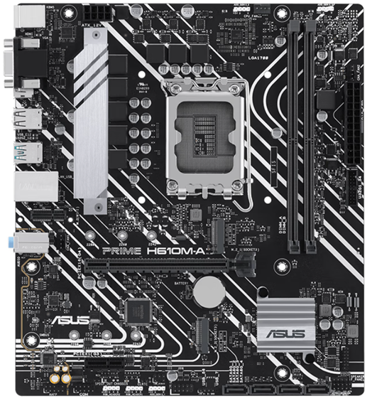  
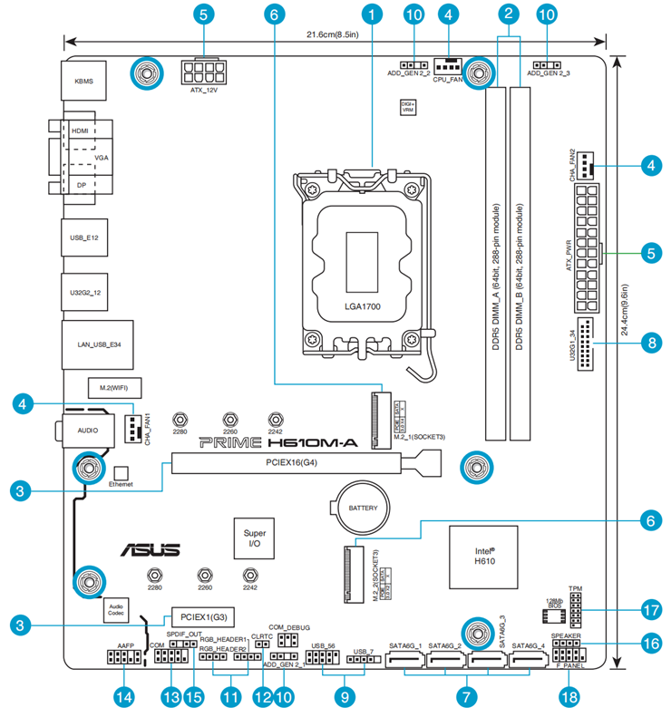  
如图所示是目前 DIY 主机配置中经常见到的一块主板：华硕 PRIME H610M-A，适用于 Intel 第 12-13 代 Core™ 处理器。我们将以这块主板为例分析构成主机的各个部件

### CPU

观察上图（来自华硕 PRIME H610M-A 电子说明书）中标签 1 指示位置，PRIME H610M-A 具备一个 LGA1700 处理器插槽。在主板说明书（包括各大电商平台的主板详情页）中可以发现，该主板可以安装的处理器为使用 LGA1700 插槽的 12 及 13 代 Intel Core™ 处理器，包含 Intel Core™ i3-12100(F), Intel Core™ i5-12400(F), Intel Core™ i5-12490F, Intel Core™ i3-13100(F), Intel Core™ i5-13400(F)等，具体可参考 Intel 官网 www.intel.cn 的规格描述

该插槽上安装的 CPU (Central Processing Unit)是整台电脑的核心部件，是计算机系统的整数/浮点运算和控制核心，起到处理指令，运行可执行程序，与其他部件通信，通过自带的时钟发生器命令其他硬件的正常工作，以及对计算机运行过程中出现的异常情况做出中断反馈的作用。非常符合认知地，在目前，CPU 的性能是影响整台电脑计算性能的重中之重。CPU 的性能是可以根据所处系列与后缀判断的。目前为消费级市场供应 CPU 的厂商主要有两家：Intel 与 AMD。无论哪一方，其旗下消费级 CPU 系列（Intel 的 Core™ 系列以及 AMD 的 Ryzen™ 系列）在同一代中均遵循后缀越大则核心越多（当然也可以核心数目与前者相等）、综合性能越高的特点。例如，同为 14 代酷睿处理器的 Intel Core™ i5-14600K 与 Intel Core™ i9-14900K 相比，后者的性能必定高于前者。同时，CPU 的型号后缀也可以给出一些 CPU 参数上的说明，例如 Intel 的 CPU 中，后缀带 K 代表具有超频能力，带 F 代表没有核显，带 C 代表核显强化，带 T 代表能耗表现强化，带 KS 代表特挑超频体质，带 X 代表是为高端工作站设计的多核心 CPU；AMD 的 Ryzen™ CPU 中，后缀带 X 代表相比不带 X 的同型号处理器是定位高一级的版本，带 U 代表核显强化

而当跨厂家或跨代比较处理器性能的时候，就可以用测评媒体制作的天梯图。无论何 CPU，在天梯图上遵循的排序必定是位置越高、性能越强

在下一页，我们可以看到目前（截止 2024-01）市面上大部分消费级 CPU 的性能排行天梯图

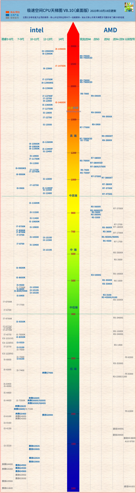

主板上的 CPU 附近（一般是左侧和上侧）排列着两行电感与电容，这就是 CPU 的供电电路。供电电路通过 PWM 控制芯片、变压模块、电感与电容等元件将电源输入给主板的 12V 直流电转化为 1.5V 以下的稳压直流电并供给 CPU 使用。由于性能较高的 CPU 功耗通常较高，例如笔者正在使用的 AMD Ryzen™ 9 7950X 作为 7000 系 Ryzen™ 的旗舰 CPU 而具有约 225W 的全核心 PBO 功耗，Intel 的新旗舰 14900K 默认睿频下进行浮点运算测试时满载功耗更是突破了 300W，主板供电电路的用料对主板能否“承载”某颗你心仪的 CPU 的功耗起了决定性作用。通过计数主板上的电感个数，减去 1 至 2（一般有 1 至 2 项供电电路是为核心显卡服务的）再乘以这些电感的标定电流（可以从该主板的技术手册中查阅），我们可以较准确地算出主板最大承载电流；再乘以 CPU 的典型工作电压 1.2V，就可以得到主板最大输出功率。这些操作相对比较麻烦，需要查询主板与 CPU 供应商的网页，在之后挑选硬件的部分，笔者也会提出一些搭配主板与 CPU 的经验公式以供参考

### 内存

如果大家已经学完或正在学习《程序设计基础》课程，那么在课程中我们会认识到 C 语言的重要操作工具：指针。指针创造了一种映射关系，为一个变量对应了一个十六进制数字，这个数字像是变量的门牌号，携带了这个数字的指针便可以在访问的时候翻找出对应的变量存储的值到底是多少。因此，我们将这种指针携带着的，通过使用 & 运算符可以获取的十六进制数字称为“地址”，指针可以获得的就是某变量的地址，而地址指出的恰恰就是内存中变量位于何处

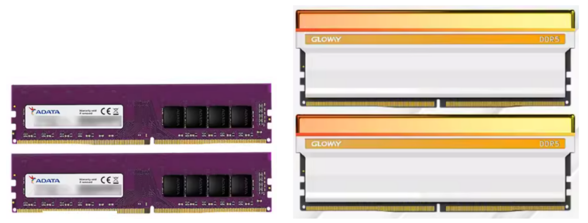

上面两张图都是物理意义上的内存。内存是一种易失性存储器（RAM），特点是断电后数据消失，存取速度较快，容量一般大于 CPU 内置的缓存而小于硬盘，起到为 CPU 正在运行与加载的程序提供输入输出空间的作用。一般，CPU 可以通过物理连通的导线直接访问内存空间，并且执行从内存某处获取数据或将数据写入内存某处的操作（正如前面所述，C 语言中的指针访问变量的过程其实与 CPU 中的指向内存某处的指令一一对应）。程序运行时输入与输出的数据都会通过内存进行缓冲，这样的模式有利于提升程序执行的效率。目前的内存是由几个 DRAM 存储颗粒和一个内存控制芯片焊接在一张印刷电路板上而组成的，部分价格比较高、发热比较大的内存会带有内存马甲，以作散热与优化外观的作用。也有些内存条会带有可编程的 RGB 灯珠，成为机箱内 RGB 光源的其中一部分

回到前面的主板解析图，在 CPU 右侧，标签 2 指示位置，这里就是主板的内存槽，一共两根。消费级主板一般有 2 至 4 条内存插槽，可以安装 2 至 4 条内存。目前市面上的台式电脑用的内存主要有 DDR4 与 DDR5 两种规格，两种规格的内存互不兼容、无法通用，因而在选择硬件时必须注意主板标明使用的是哪种内存，再选择相应的产品

CPU 对内存访问时的效率在 CPU 和主板不变时由内存频率与内存时序共同决定，频率起到主要作用。这里需要特别注意的是，时序的单位是时钟周期，时钟周期为频率（单位 Mhz）的倒数，例如对于 DDR4-3000 的内存条，1 时钟周期= 0.6667ns，而对于 DDR4-2666 的内存条，1 时钟周期= 0.75ns。由于 DDR5 内存条频率一般远高于 DDR4 内存条，DDR5 内存条的单个时钟周期远低于 DDR4 内存条，而内存与 CPU 之间的通信时长一般不发生变化，因而 DDR5 内存条的时序会大于 DDR4 内存条。例如，6000 CL30 时序的 DDR5 内存条和 CPU 内存控制器间的列访问选通延迟（CL）与 3000 CL15 时序的 DDR5 内存条虽然在参数上不同，但实际时间间隔是一致的

我们可以想象一个外星人，他们的计时与我们一样都是以小时为单位，但是他们将 1 个标准地球日划分为 3 小时，而我们的一个地球日却有 24 小时：虽然双方的“小时”单位是一致的，但是一个外星人小时在实际时长上等于八个地球人小时。内存也是一样

内存的实际频率满足水桶效应，其实际最大工作频率等于内存条最大支持频率、主板最大支持频率、CPU 内存控制器最大支持频率三者的最小值。例如，在某些标注只支持 DDR5-6800 的主板上，即使你购买了内存控制器非常强大的 Core™ i9-14900K 与影驰名人堂 OC LAB 的 DDR5-8000 特挑内存条，内存的最大频率仍然只能到 6800Mhz 左右。因此，购买内存时，内存条频率要根据自身需求、预算、CPU 与主板标定的最大支持频率合理选择

### PCIe 扩展设备

由主板、内存、CPU 组成的系统称为 PC 主机的硬件最小系统。理论上来说，它们构成了完整的满足图灵机定义的计算机，仅需提供电源便可完成计算机的全部任务。但是经过了多年发展，人们早已不用通过手动覆写内存以及为 CPU 直接输入汇编指令进行操作，为了将计算机操作便捷化、可视化，或是增加或特异性强化主机某方面的功能，扩展硬件由此出现。目前常见的扩展硬件主要包含显卡、声卡、网卡与硬盘，由于当下用于这些设备与 CPU 通信的模式大都为通过 PCIe 总线，在此将它们统称为 PCIe 扩展设备

回到前面的主板解析图，在 CPU 下方，标签 3 指示位置，即为安装 PCIe 扩展设备的 PCIe 插槽。接下来我们来了解 PCIe 到底是什么

#### PCIe 总线

想象某省份有 n 个城市，我们把它们分别称为从甲、乙、丙……城市，自古以来这几个城市独立发展，相互之间没有道路，来往很不方便。但是现在随着贸易逐渐发展，商品运输机械化，n 个城市之间修建互通的高速路的需求已迫在眉睫。那么，具体道路应当如何设计？很容易地，可以想到有以下三种修路方式

**方案一** 每个城市间都单独修一条高速路，路的总数目是城市数量的组合数。这种方法的好处是，城市之间运输的路线是最短的，效率高用时短，如果甲城市想向丁城市送一车货物，只需要派车走甲丁之间的高速公路即可直接到达；但是坏处是成本非常高，并且城市数量逐渐增加时，不可避免地会遇到道路交叉问题，比较难设计

**方案二** n 个城市一起建一个高速互通，都把高速连接到互通上，这样甲城市想向丁城市送一车货物，就先派车到互通，从互通再发车到丁——这种方式的效率比较低，能同时承载的车流量很少，但相对于方案一，如果城市比较多或者距离远，成本会低很多，道路的设计也会相对简单

**方案三** n 个城市一起建一条共用的高速路，这条主路建得特别宽，以至于可以承载较大的车流量；主路头尾两端可以连接 n 个城市其中的两个比较核心的大城市，也可以头尾两端什么都不连接，甚至可以头接尾形成一个环路。其他城市自己建比较短的一段路，通过高速入口与主路连接。这种方式在拓扑学上与方案二是同胚的，但是由于主路比较宽，而不像二中所有车辆都要挤在窄窄的互通处，实际效率会高于方案二，但是成本也略高于方案二

计算机中硬件之间的互相连接正如上述城市间的交流，也有以上三种布线方式。经过工程师们的实践验证，方案三在成本、传输速度、主板布线难度、信号抗串扰能力等方面较均衡，是比较适合于实际应用的一种方案。基于这种方案的数据信号传递的布线方式就称作总线型拓扑方式。另外，方案一称作网型拓扑方式，方案二称作星型拓扑方式

PCIe，全称 Peripheral Component Interconnect Express，就是目前常用的计算机前端总线之一，是 Intel 在早期提出的 PCI 总线的正统继任者，起到连接 CPU、显卡、硬盘等硬件的作用（所谓“前端总线”，即 CPU 与其他硬件，例如显卡等，之间的连接总线，与 CPU 内部核心之间、核心与缓存之间连接的“后端总线”做区分）

PCIe 目前有 7 代协议，从 PCIe 1.0 至 PCIe 7.0。实际投入生产的主板中目前仅有前五代协议接口，并且以支持 PCIe 3.0 与 PCIe 4.0 协议的插槽为主，仅搭载 Intel Z790 或 AMD B650E/X670E 芯片组的主板可能会带有支持 PCIe 5.0 协议的插槽。但是，不用担心 PCIe 的版本兼容性问题，与内存标准不同，PCIe 协议与 PCIe 接口标准均支持上下兼容，非同代的 PCIe 设备与 PCIe 接口之间遵循木桶原则：最大传输速率由两者中较老版本的传输速率决定。例如，将 PCIe 4.0 \* 4 接口的固态硬盘插在支持 PCIe 3.0 \* 4 的 M.2 接口上，最大传输速率决定于 PCIe 3.0 \* 4 的最大带宽，反之亦然

作为主机上的“高速公路”，PCIe 总线自然具有其高效性。它是一种双工总线，可以同时向两侧传递数据；它的频率很快，吞吐量大，单条 PCIe 5.0 线路传输速率可以达到 32 GT/s，即每秒双方信息交流达 32G 次，折合约 4.0 GB/s 总线带宽；它也具有很好的延展性，通过提供多根并置的 PCIe 线路，可以使得数据传输速率成倍提升，一条 PCIe 5.0 \* 16 的理论总线带宽为 16 \* 4 = 64 GB/s，远远超过目前高速硬盘与显卡需要的数据传输带宽

#### 显卡

显卡是主板 PCIe 插槽上的常客。目前向消费级市场提供显卡产品的厂商很多，但其中的显卡芯片提供商只有两家：Nvidia（英伟达）与 AMD（收购了老牌显卡厂 Ati）。Intel 与国产厂商摩尔线程的独立显卡目前仍处于起步阶段

显卡的制造厂很多。国内 N 卡（Nvidia）侧消费端有华硕、技嘉、微星、七彩虹、耕升、影驰、索泰、映众，这七家是 Nvidia 直接授权的显卡生产厂商；另外镭风与万丽这两个品牌分别属于七彩虹与柏能（索泰、映众品牌的厂商）旗下，类似于红米之于小米的关系；铭瑄、梅捷品牌隶属于商科集团，也是大厂商，类似于 Nvidia 的“预备 AIC”，可以从 Nvidia 处直接得到显卡芯片；盈通、翔升选购时优先级较低，但也是正规厂商；昂达相对特殊，本为 Nvidia 直接授权，但 40 系发售时被除名，目前不确定原因。国内 A 卡侧消费端的正规厂商则有蓝宝石、华擎、华硕、迪兰、技嘉、微星、撼讯、讯景、盈通、瀚铠、速驹这十一家。其余所有品牌的显卡统一为杂牌，核心来源未知，售后服务未知，不推荐购买

显卡的结构与最小系统比较相似，由显卡芯片（类似 CPU，称 GPU）、显存（类似内存）、PCB（类似主板，带有芯片与显存的供电模块）组成，并自带显卡芯片与显存的散热器

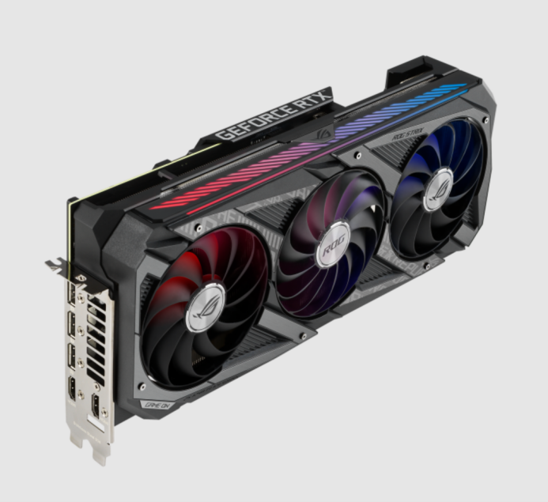  
一张典型显卡的外观，型号为 ASUS ROG Strix RTX3080-10G Gaming。在图片的左侧，巨大的风冷散热器的背后，可以看见显卡的 PCB

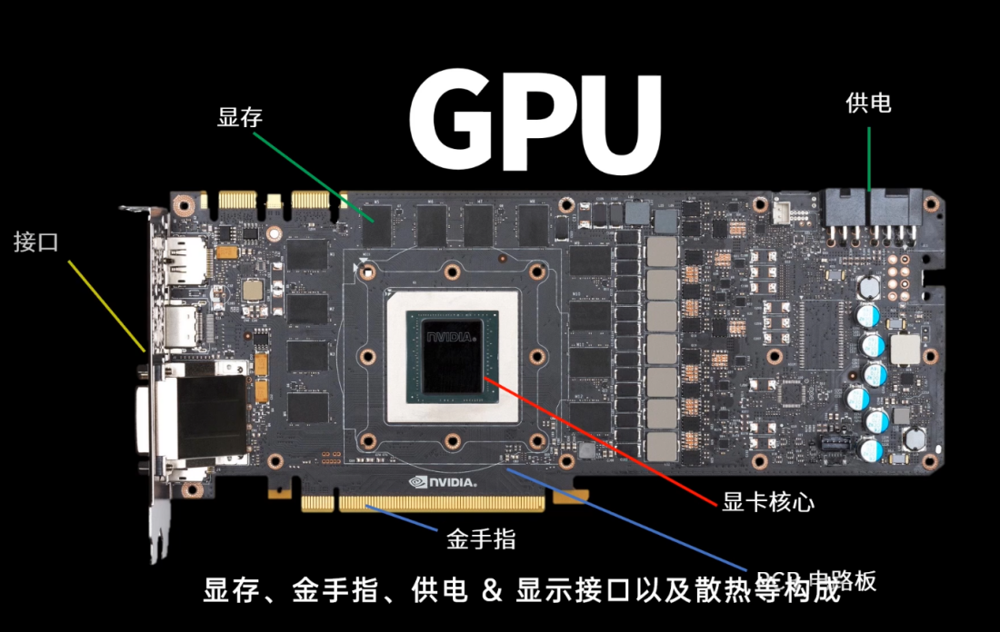  
拆开显卡，可以看见 PCB 上焊接着显卡的芯片与显存

显卡芯片由数量众多（数千乃至上万）的小核心——流处理器组成。与 CPU 的设计思路不同，显卡核心采取“人海战术”，使用大量相对简单、能力适用于进行渲染或图形计算的流处理器应对显示处理任务

基于显卡的结构特点，显卡核心非常适用于大量并行计算的场景，例如人工智能神经网络等。这也就是我们可能听说过的“深度学习需要高端显卡”这一说法的来源。虽然显卡中的每一个小核心（“流处理器”）的计算能力并没有 CPU 的核心强，但其数量多，并且在应对矩阵乘法等简单计算任务的时候处理效率尚可，因而深度学习效率相对 CPU 高很多。前段时间火热的人工智能对话模型 ChatGPT，其训练设备正是 Nvidia 的 V100 计算卡阵列

当然，并不是每一块数千元乃至上万元的高端显卡都可以用作并行计算加速工具。目前，Nvidia 公司的 CUDA 架构占据了人工智能领域 GPU 计算的生态高位，几乎形成垄断态势。CUDA 全称为统一计算设备架构（Compute Unified Device Architecture），它的革命性在于，将 GPU 的核心与 CPU 的核心等同起来，并且配套诞生了适用于 Nvidia 显卡的 SASS 指令集，类似台式电脑 CPU 的 x86-amd64 指令集，使得程序员可以通过 NVCC 编译器，像传统的 CPU 编程中 C 语言的 MinGW 编译层通过 x86 指令集对 CPU 进行命令一样，对 CUDA 核心进行编程操作。因此，如果大家有使用 GPU 进行深度学习的需求，目前的消费级市场上有且仅有 Nvidia 显卡一种选择

显卡的另一大用途自然就是其本身的用途——显示计算。对于有以高分辨率高帧率游玩各类 PC 端游戏、使用达芬奇等专业软件进行视频剪辑调色与特效制作等需求的人来说，一张比较好的显卡也必不可少。不过这时，可以酌情考虑具有更高性价比的 AMD 显卡

判断显卡性能强弱的方式与前述判断 CPU 的方式类似，也可以参考显卡的天梯图。此处不再详述

#### NVMe M.2 硬盘

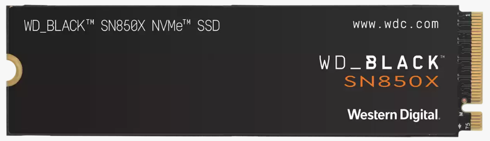

NVMe（Non-volatile Memory Express），中文名为非易失性内存主机控制器传输协议。虽然它的中文名翻译非常别扭，但是 NVMe 的本质很简单，是固态硬盘时代诞生的一种硬盘与 CPU 之间通信的协议

NVMe 协议的诞生源于基于 NAND 颗粒的固态硬盘的发展。随着固态硬盘存储颗粒支持的读写速度越来越快，早期仅支持 32 个 I/O 队列、极速 6 GB/s 的 SATA 协议成为了限制硬盘数据传输速度的瓶颈。因此，NVMe 诞生了，它的核心思想是利用并行、低延迟的基础介质数据通道提升硬盘读写速度。相比 SAS 和 SATA 协议，NVMe 可以支持 64000 个左右的 I/O 队列，相当于将一条一车道的马路拓宽到 2000 车道，大大增加了数据传输速率，因而 NVMe 让 I/O 任务频率更快，彻底解决了数据传输的瓶颈，其 IOPS（每秒输入/输出操作）可超过 100 万，是 AHCI 硬盘的 900% 以上

那么，为什么我们常见的 NVMe 协议的固态硬盘反而标注的是最高支持的 PCIe 协议的版本（例如 PCIe 4.0 硬盘）？PCIe 与 NVMe 是不是存在某种关系？

当然是的。NVMe 定义的是硬盘读写命令和数据的格式，而实际的数据传输基于 PCIe 协议。好比仓库的货物进出，NVMe 定义的是仓库管理员手上的进出库统计本的格式，而 PCIe 则定义了真正进出库的货物包装的形式。上一自然段的解释可以理解成 NVMe 协议下的硬盘“仓库”的进出库管理员的数目比 SATA 协议下的进出库管理员的数目多了足足 2000 倍，因而这个“仓库”的“进出库吞吐量”不会因为仓库管理员忙不过来而被限制。当这一环节不成为瓶颈的时候，真正进出库的货物的实际吞吐量（即 PCIe 的实际通道带宽）就能反映硬盘的最高速度。用计算机科学的严格解释就是，**NVMe 是一个应用层的协议，PCIe 是一个物理层的协议。NVMe 协议通常情况下是跑在 PCIe 协议栈上**

那 M.2 又是什么？M.2 的定义并不像 NVMe 或 PCIe 那么复杂。正如家里的“电饭锅线接口”的学名是“IEC60320-C13/14 中压交流电非锁定连接器”，M.2 也只是一种接口标准的学名罢了。也有很多老玩家直接把这个口称为“NVMe 硬盘接口”，这其实并不严谨，M.2 与 NVMe 协议并不绑定，曾经也有基于 SATA 协议的 M.2 固态硬盘，但随着技术进步，NVMe 协议硬盘价格下行（感谢长江存储 3D NAND 颗粒技术的突破成功打下了国内固态硬盘的价格），SATA M.2 固态硬盘早已被历史尘封，目前市面上几乎全部新的 M.2 硬盘均基于 NVMe 协议

还是回到前面的主板解析图，在 PCIe 插槽附近，标签 6 指示位置，我们可以看到两个 M.2 接口。下图是主板照片中 M.2 接口的外形

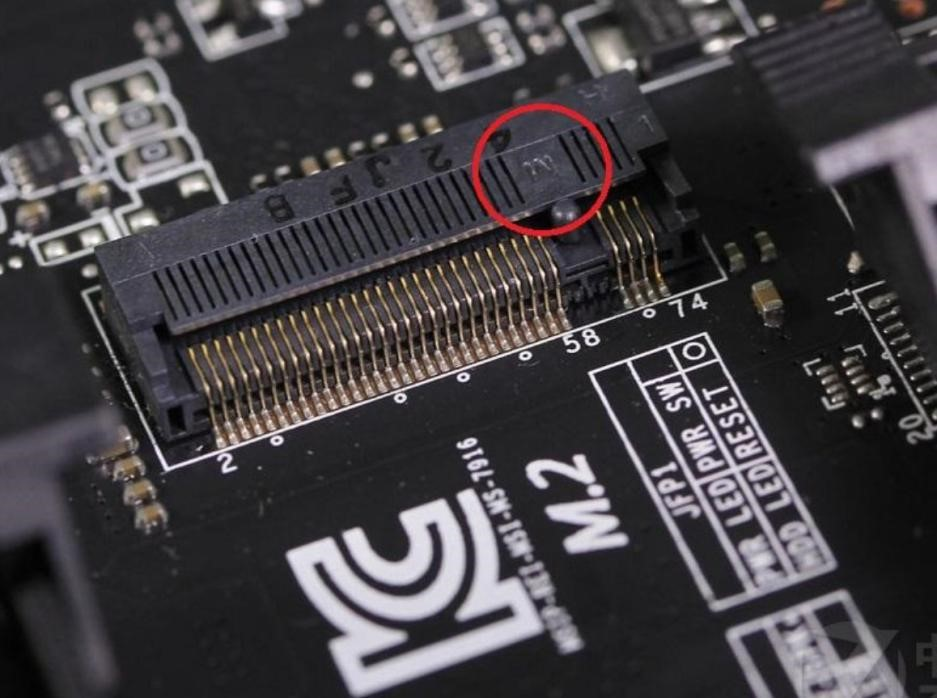

这就是目前最常见的 M-Key M.2 接口。M-Key 母口的特点是具有一个触点空隙，对应的 M-Key 公口在相同的位置上具有一个豁口使得公母口适配。同时，当我们将 M-Key 母口的触点侧面对自己，则触点的空隙在整个 M.2 口的偏右侧；当我们将接口为 M-Key 公口的固态硬盘正放，且头部（具有触点的一端）远离自己，尾部（具有一个半圆孔的一端）靠近自己，即从尾向头看时，则 M-Key 公口的豁口在整个 M-Key 公口的偏右侧。反之，则为 B-Key；如果某个 M.2 母口具有两个触点空隙或公口具有两个豁口，则为 M&B-Key。随着 SATA M.2 硬盘逐渐退市，而支持 NVMe 的 M.2 接口只有 M-Key 类型，目前市面上几乎全部 M.2 固态硬盘与几乎全部主板上的 M.2 接口均为 M-Key

**那市面上这么多品牌的 M.2 硬盘应当如何选择？**

首先，目前能独立生产用于消费级 NVMe M.2 硬盘的 NAND 闪存颗粒的公司有：三星、SK 海力士、西部数据（闪迪）、铠侠（东芝）、镁光、英特尔、长江存储。这几家公司旗下消费端的品牌名称分别为三星、海力士、西数（WD）、铠侠（KIOXIA）、英睿达（Crucial）、Solidigm（Intel 原闪存部门，现由 SK 海力士运营）、致钛。以上七个品牌是使用原厂闪存、品质与售后最好的固态硬盘品牌，为第一梯队，称为“原厂固态”

其次是具有多年固态硬盘研发与销售经验，品牌力较高的几个厂商及其品牌，如宏碁（宏碁掠夺者）、金士顿、海盗船、威刚等，它们的产品使用的是来自上述七个厂商生产的闪存颗粒，主控方案与 PCB 方案可能为自己设计。这些厂家的产品综合水平较高，但方差也较大，同一个厂家的有些产品无论性能还是性价比都很高，而另一些产品则问题百出，极其不推荐购买：例如金士顿，其旗下的 KC3000 硬盘属于前者，NV2 硬盘则属于后者。这些品牌为第二梯队。它们的产品需要斟酌、对比后购买

再次是一些品牌力较低的硬盘厂商及其品牌，例如金百达、七彩虹、梵想等，主要为国内小众品牌。如今这些品牌大多数使用长江存储，但过去有使用回收颗粒、混用颗粒制造固态硬盘的历史，为第三梯队。它们的产品不推荐购买作为系统盘与重要数据的存储盘，但可以在谨慎考虑、上网查阅了解后挑出其中较可靠的型号（发布时间越新越好）作为不重要文件的存储盘等

另外需要说明的是，固态硬盘使用的 NAND 颗粒目前主要有 TLC 与 QLC 两种。TLC 颗粒一个存储单位拥有 8 种状态，可以存储 3bit 数据；QLC 颗粒一个存储单位拥有 16 种状态，可以存储 4bit 数据。因而，QLC 颗粒拥有更高的存储密度，相同容量的 QLC 硬盘也会比 TLC 更便宜

**—— 那么，代价是什么呢？**

目前的 QLC 技术下，颗粒寿命仍然较短，在使用一段时间后颗粒发生故障的概率显著大于 TLC 颗粒。同时由于 QLC 一个存储单位的状态数大于 TLC，其操作对主控压力显著增大，因此写入/读取速度，尤其是随机写入/读取速度较慢，在游戏等应用场景下感知明显

目前市面上的 QLC 硬盘主要有 Solidigm P41 Plus，致钛 Ti600，英睿达 P3 Plus 等。综合考虑成本与体验，以及数据的安全性，不推荐使用 QLC 作为系统盘，但可以用于存储相对不重要的文件，发挥 QLC 硬盘顺序读写的较长处，扬长避短的同时节约预算

通过在浏览器中输入 **某款硬盘名字 + TLC** 或 **某款硬盘名字+QLC**，一般可以查询到某款硬盘的颗粒究竟属于哪一类，以及大家对这块硬盘的评价如何

  
上图为笔者 PC 主机的硬盘选择，仅作参考

#### 南桥

早期的主板上有两个很重要的芯片，分别叫北桥芯片和南桥芯片，北桥芯片与南桥芯片统称主板芯片组，在总线上起到“枢纽”作用。这两兄弟的存在有很深的历史渊源。早期的 CPU 制造工艺相对落后，晶体管的数量没有现在这么多，集成度较低，因此有很多功能模块必须要由主板上的芯片组来承担。这时，设计人员将 CPU 的不同功能分为两大类，分别由一块芯片控制。CPU 与内存的数据交换、与图形处理卡的数据交换、与直连 AGP/PCI-Express（PCIe）插槽的数据交换是“高速的数据传输”，统一由北桥芯片组负责，因此北桥也被称为高速芯片组；CPU 与其他输入输出设备，例如 PCI 接口、后置 IO 面板、前置机箱接口、硬盘接口等之间的数据交换是“低速的数据传输”，统一由南桥芯片组负责，因此南桥也被称为低速芯片组

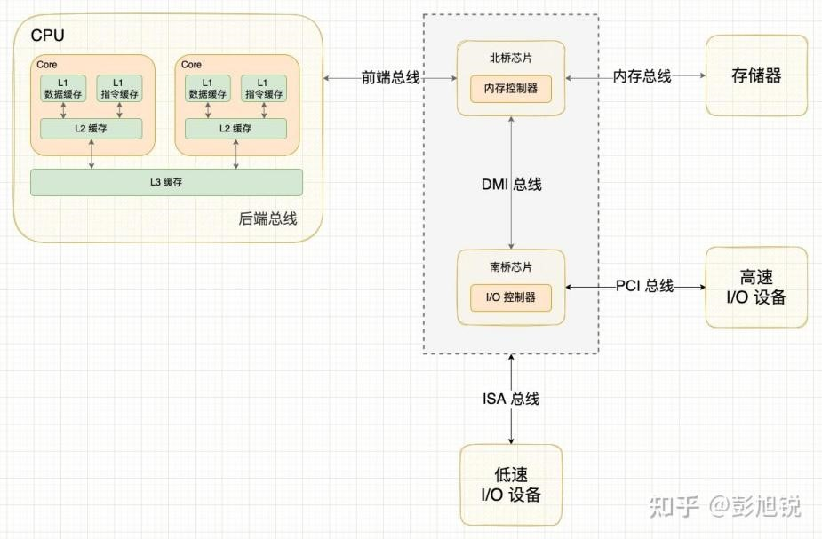

随着光刻制造工艺越来越先进，集成度越来越高，设计制造 CPU 与芯片组的工程师们终于发现，既然北桥与 CPU 联系密切、传输吞吐量大，单独的北桥芯片远不如直接在 CPU 晶片上集成这些功能硬件的效率高、延迟低。于是，目前的 CPU 本身就包含了内存控制器以及一部分 PCIe 通道的控制器，北桥芯片组由此被取缔，主板也就只保留了南桥。由于 CPU 的 PCIe 控制器规模有限，PCI 接口又日渐无人问津，南桥自然而然也抛弃 PCI，接手到了一部分 PCIe 通道的控制功能。所以现在无论是 Intel 还是 AMD，它们的消费级芯片组均只剩下了南桥，只有古董级别的主板还保留着北桥

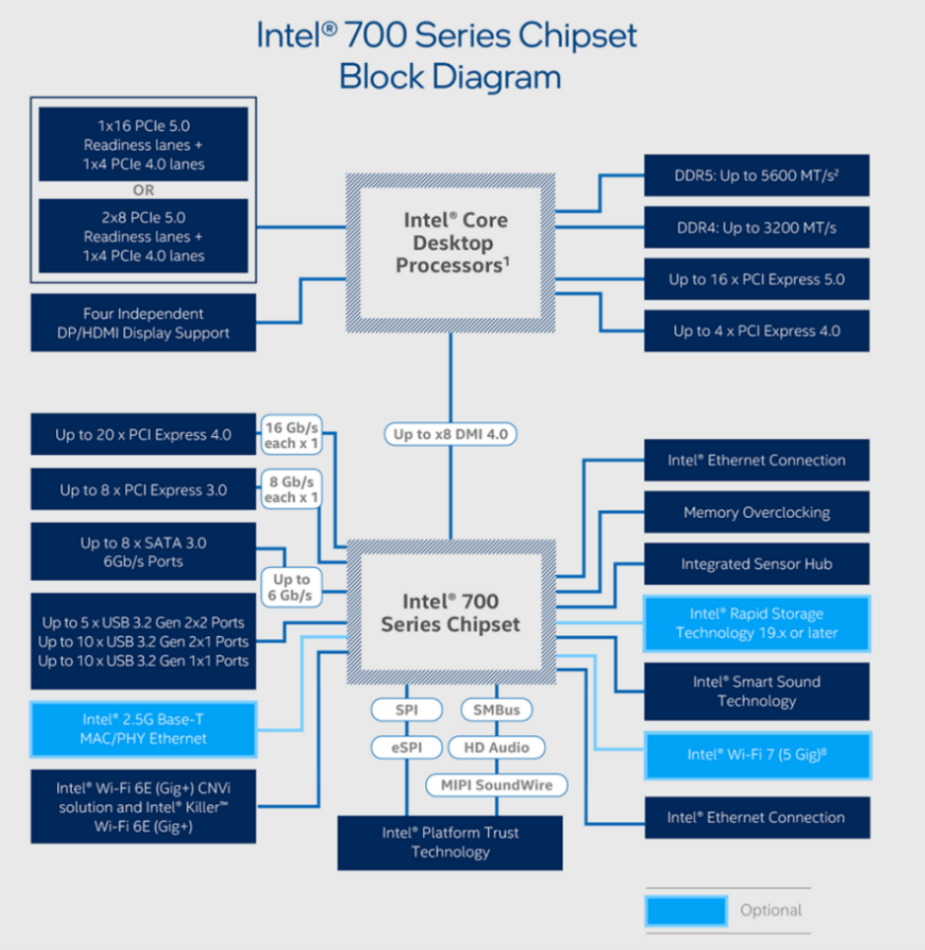  
我们以 Intel 700 系列芯片组（例如 Z790 芯片组）为例认识芯片组与 CPU 的分工模式

CPU 如同公司总裁，执掌总公司总经理职位，指导总公司中的职员工作。由 CPU 直接管控的“员工”有：一条 \* 16 带宽的 PCIe 5.0 协议通道，一般用于与显卡通信，可以拆分成两条 \* 8 带宽的 PCIe 5.0 通道；一条 PCIe 4.0 协议通道，一般引出成 M.2 接口规格，用于与 NVM-Express 协议的高速固态硬盘通信，作系统盘之用；DDR5 或 DDR4 内存条，由主板厂商自行决定安装那种型号的内存条插槽，CPU 中同时拥有两种内存的控制器；四路独立的 DP/HDMI 显示输出接口，与核心显卡相连，用于核显的视频输出

CPU 与 700 系列芯片组之间通过 \*8 带宽的 DMI 4.0 总线通道相连，好比总公司与分公司之间的电话专线，而芯片组自然执掌分公司总经理职位，指导分公司中的职员工作。容易理解，这条“电话专线”的带宽决定了分公司所有职员与总公司方面的联系的速度上限。即使分公司所有员工都来到分公司总经理处，想让分公司总经理（也就是芯片组）代它与总公司的总经理（也就是 CPU）联系，或者总经理想与分公司的很多个员工建立联系，分公司总经理与总公司处交流的速度上限也只能达到“电话专线”的满速，后来者只好乖乖排队。幸好，正如一个分公司中的每个员工不会在同一时间都要找总公司联系，南桥芯片组引出的设备不可能同时进行输入输出操作，因而南桥引出的通道的总带宽可以远大于自身与 CPU 联系的 DMI 4.0 总线通道的带宽（事实上 DMI 与 PCIe 相同，DMI 4.0 \* 8 的带宽仅有 PCIe 4.0 \* 8 的带宽，也就是约 16GB/s）通过 700 系芯片组，可以引出至多 20 条 PCIe 4.0 协议通道，8 条 PCIe 3.0 协议通道，8 个 6Gb/s 的 SATA3 硬盘接口，5 个 USB 3.2Gen2 \* 2 接口，10 个 USB 3.2Gen2 \* 1 接口，10 个 USB 3.2Gen1 \* 1（即 USB3.1）接口，一张 2.5G 有线网卡，一张最高支持 WiFi 7 的无线网卡等，这些所有的扩展设备共享 DMI 4.0 \* 8 总线的传输速率上限

同时，主板芯片组的代号也成为了我们认识主板的标志之一。目前 Intel 最新的芯片组从低端到高端分别为 H610（H710 未出）-B760-H770-Z790，AMD 最新的芯片组从低端到高端分别为 A620-B650-B650E-X670-X670E。更高规格的芯片组一般意味着主板供电规模更大、用料更好、扩展性更强，能支持更高端的 CPU，当然价格也更贵（在同一主板厂商的产品线中满足以上规律）

同时，芯片组与 CPU 具备一定的对应关系，搭载不同的芯片组的主板，其对应兼容的 CPU 代数也不同

Intel 方面，从 100 系列芯片组（例如 Z170）至 700 系列芯片组（例如 Z790）对应的 CPU 代数如下表所示（仅含常见芯片组）

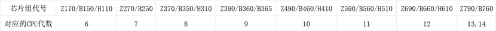

AMD 的芯片组则更有规律，兼容性如下表

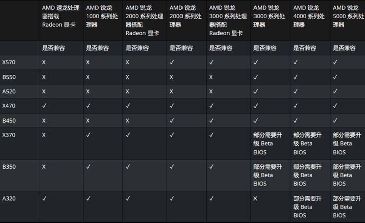

第一个数字为 6 的 AMD 芯片组则单独为使用了 AM5 接口的 7/8 代 Ryzen™ 处理器设计，与使用 AM4 接口的前几代处理器均不兼容

需要注意的是，部分芯片组在新一代 CPU 没有更换接口的情况下，会提供与前后代 CPU 的兼容支持，例如与 12 代 Core™ CPU 对应的 Z690/B660 芯片组刷写 BIOS 后也可以支持 13/14 代 Core™ CPU，这时，你可以查阅主板说明书获取 CPU 兼容性列表，确认自己选购的 CPU 是否支持选购的主板

### CPU 散热器

随着 CPU 制造工艺逐步提升、规模逐步扩大，CPU 的功耗也越来越大。由于可以将 CPU 看作纯电阻元件，CPU 消耗的每一焦耳能量都会转化成热量。如今，顶级 CPU 已经变成了 300W 发热功率的超级电热器件，因此对散热器的散热效能要求也逐步提升，市场上 CPU 散热器的规模正在逐渐扩大

对于目前主流的 CPU 散热器而言，无论是何种散热方案，核心思想是通过一个热循环将 CPU 顶盖上发出的热量传导到大面积的散热片上，随后使用流通的空气等介质将热量传送走。因而，散热器设计的核心问题就变成了

1. 如何设计一个足够高效的热力学循环，将 CPU 的热量传导到散热鳍片
2. 如何增大鳍片的有效面积或增加鳍片表面的空气流速

目前市面上的解决方案大致分为两大类：热管式风冷散热器与水冷式散热器（截稿前，CPU 散热器中仍少见半导体制冷片或压缩机方案）

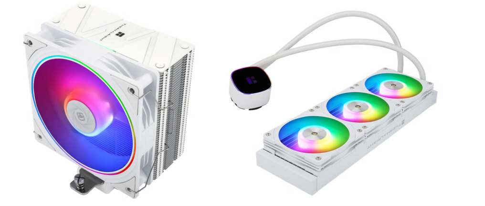

上图中左右两个散热器分别示意了热管风冷散热器与水冷散热器的外形（两款分别为利民 AS120 EVO W 与利民 Frozen Horizon 360 W）

根据厂家的设计不同，散热器外形可能会有不同，但是大致外形不会有区别。热管风冷散热器的本体如下图所示，是穿有热管的铝制（曾经也有产品是全铜，但散热效率并不会有明显的提升）鳍片塔。热管是一类内抽真空、两端封闭的铜管，管内烧结有细铜粉，形成较为粗糙多孔的内表面。同时，热管内还含有一定量的导热液体（一般为去离子水）。当热管底部从 CPU 上吸收到热量时，由于管内高真空度环境，水的饱和蒸汽压很小，热管内的水迅速蒸发带走热量。在鳍片一侧，即热管顶端，水放热液化，将热量带给鳍片，液化后的水回到热管底部继续进行热力学循环，从而源源不断地从 CPU 处带走热量。由于这一循环的存在，热管的导热系数很高，远远超过相同外形和大小的实心金属棒（块），从而使得热管风冷散热器在规模类似的情况下效能远高于挤铝或金属铣削工艺制造的实心散热器

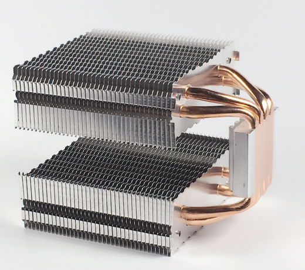

水冷散热器则采用了另一种思路，使用水流的循环带走热量。目前，较多用户选择的是 AIO 水冷散热器，即水泵、水冷液、冷排、冷头在出厂时已全部组装完毕，组装电脑时插电即用。也有部分玩家选择自己采购水箱、亚克力水管、冷排等自己组装水冷系统，这种水冷散热器便叫做分体式水冷散热器，简称分体水。分体水在此不作详述，我们继续分析 AIO 水冷。AIO 水冷由进出水管连接着两个部件，其一为冷头，包含用于与 CPU 进行热量交换的铜水道板、离心式水泵以及用于固定在主板上的扣具；其二为冷排，即上上图中长方形并安装着三个风扇的部分。它的作用与热管风冷散热器的鳍片类似，将来自冷头的热水通过冷排中的水道与外界空气充分接触，传走热量，恢复成冷水，再通过回水管返回冷头，完成循环

无论风冷还是水冷散热器，几乎都需要安装风扇。风扇的作用是维持鳍片上的气流速度，增加散热效率，防止鳍片处热空气堆积导致热交换效率降低。在目前市面上的散热器中，风扇的风压与风量对性能影响很大。因此，选择一款合适的散热器，不仅要考虑本体规模，也要考虑附带风扇的性能水平（事实上，以散热大厂利民为例，其旗下的很多好风扇都是与某款水冷强绑定的，例如 E12-S (2000rpm) 绑定于 Frozen Notte 和 Frozen Warframe 系列水冷散热器，K12 绑定于 Core Matrix 和 Frozen Vision 系列水冷散热器，乃至利民自己的最强滚珠轴承扇 B12-S Extreme 也绑定于 Frozen Horizon 系列水冷散热器）

目前市面上的散热器厂商百花齐放，并且经过多年价格战，产品价格显著下降，一款尚可的 360 规格（即冷排规格可以装三把 120 mm 风扇）AIO 水冷散热器只需要 400 元左右便可买到。目前推荐大家可以选购国内厂商的散热器，例如利民、雅俊、瓦尔基里等品牌。当然，也可以去 B 站查找自己喜欢的散热器的性能详解与测评，或是通过多型号散热器的横评来选择适合自己的一款

### 机箱、机箱风扇与电源

事实上，机箱、机箱风扇与电源并不是计算机系统的一部分。机箱的实际作用仅仅是为电脑硬件提供合理、防止异物进入且有良好电磁屏蔽的密闭环境，使得电脑可以正常工作；机箱风扇是辅助散热器散热，使得温度控制更良好；电源则是为主板、CPU、显卡等零件供电。下一章中，笔者会大致讲解如何挑选合适的机箱、机箱风扇与电源

## DIY PC 硬件选择原理与方法

### 论 U 显平衡

在新世纪初前后的十余年内，CPU 一直是整机预算配置的重中之重。2003 年前后，笔者家购买的主机配置中最耀眼的“头号人物”，便是在当时售价（即使今日的物价在对比当时时受到通货膨胀的极大影响）与如今的 Core™ i7-12700K 几乎相同的 Intel Pentium 4 处理器，拥有在当时难以想象的最高 3.8 GHz 加速频率与一条 QDR FSB 总线

但是自从各类 3A 主机游戏开始发展，很多人发现，自己比想象中更需要一款强大的显卡。由 Nvidia 带领的 GPU 革命从此将用户的预算从“升级 CPU”向“显卡与 CPU 达成预算平衡”的状态拉动。2013 年底，Nvidia Geforce GTX 780 Ti 正式推出，而同年的桌面端最强 CPU 则是 Intel Core™ i7-4770K（工作站硬件除外）。从此，旗舰显卡价格开始超越旗舰消费级 CPU

目前在 2024 年的硬件市场上，一个合适的游戏主机搭配已经可以将几乎整机价格一半的预算分给显卡。但是，读者中应该不会都是重度的游戏玩家，大部分人装配电脑也是倾向于平衡游戏性能与数据处理/办公性能。因此，不需要真的将绝大部分钱花在显卡上。同时，极度的低 U 高显（即用很差的 CPU 搭配很强的显卡）会使得显卡发挥不出应有的性能，反而不利于电脑整体性能的提高

具体的 CPU-显卡搭配可以遵循以下法则

**对于游戏主机用户**，即更加看重计算机的影音性能与游戏性能的用户，其 CPU 与显卡的预算分布最高可以上调至 1:8，但选择显卡价格不要超过选择的 CPU 售价的 8 倍太多。例如，对于游戏玩家用户，如果选择的 CPU 是 Intel Core™ i5-12490F,此款 CPU 的价格约为 900 元，900\*6=7200 元，则显卡最高可以选择售价在 6500 左右的 RTX 4070Ti Super。但是，售价约 8500 的 RTX 4080 Super 可能就不适合这款 CPU

**对于希望均衡游戏性能与办公性能的用户**，CPU 与显卡的预算分布最多可以向 1:6 靠近。（当预算充足时这个比值变大，即最多向 1:4 乃至 1:3 靠近）例如，使用一块 800 元左右的 i5-12400F 搭配一块 2800 元左右的 RTX 4060Ti 8G 显卡是合理的，因为这个配置的 CPU-显卡预算比约为 1:3.5，没有小于 1:6；使用一块 1600 元的 i5-13600KF 搭配一块 8350 元的 RTX 4080 Super 也是合理的，因为这个配置的 CPU-显卡预算比约为 1:5。但是，i5-12400F 搭配 RTX 4080 Super 就不太合理，虽然不一定会出现低 U 高显，但是肯定会使得电脑变成“偏科生”，CPU 性能偏低

**对于预算较低的用户**，优先将显卡的预算分给 CPU 与内存。因为显卡的性能差距在运行大型游戏时才能体现出来，而 CPU 与内存的选择如果太差，会导致在系统中就感觉卡顿，例如需要多任务并行等环境下。另外，内存太小甚至会导致许多软件根本无法运行。因此，如果预算有限，优先保证 CPU 和内存

### A or I? N or A？

注：如果你看不懂这个标题，你可能需要回头去看看 [第一部分（计算机组成原理基础）](#一适合随时随地阅读的计算机组成原理基础)

CPU 与显卡的品牌选择确实是一个头疼的问题，尤其是 CPU。Intel 与 AMD 应当选谁的问题自从 AMD 发布第一代 Ryzen™ 处理器以来一直被大家提出，而随着时间的推移，这个问题的答案发生了周期性变化

在 2024 年，AMD 与 Intel 正处于势均力敌的态势。理论上而言，目前选择哪一方基本可以看心情，都不会对你的主机带来决定性的影响。不过，这两家的处理器在选择上还是有一些细微差别

AMD 产品线由于一直采用瞄准对手竞品价格定价的策略，目前价位比较明确，从 7500F 开始，到 7600, 7600X, 7700, 7700X, 7800X3D, 7900, 7900X, 7900X3D, 7950X, 7950X3D 秩序井然，而且每款都比较有性价比，其 CPU 本体的性能一般都强于 Intel 在同一价位的竞品。而 Intel 在全系性价比略低于 AMD 的情况下，其产品线目前正处于 12、13、14 代鱼龙混杂的环境下，隔代产品之间的市场价比较混乱，例如 14400F，正处于一个高价低能的状态，其性能弱于 12600KF 的同时，价格比起后者居然更贵

Intel 目前仍然占据着顶级消费级 CPU 榜首。Core™ i9-13900KS 与 Core™ i9-14900K 双双打赢 7950X 登顶 CPU-Z 与 Cinebench 性能榜。所以，如果想装配目前的消费级顶配主机，还是只有 14900K + 4090 一种选择

作为一个 AMD 用户，我不得不说，对于非硬件玩家而言，AMD 需要折腾的东西比 Intel 更多。首先是 AMD 自身的内存兼容性并不理想，在 B650 与 X670 主板旧版本 BIOS 的情况下，AMD 对除了 Hynix A-Die 颗粒以外的内存具有奇怪的兼容性，例如 M-Die，可能上一批颗粒相同参数能开机，这一批就不行。于是造成内存不兼容 —— 无法开机 —— 无法刷新 bios —— 无法兼容内存 —— 无法开机的怪象。这种现象也会在部分厂商，例如出货量很大的阿斯加特（隶属于嘉合劲威公司）或金百达等品牌对内存刷写的 spd 信息错误时出现。另外是 AMD 的 PBO2 超频选项作为释放 AMD CPU 全部能力的必备条件，其操作还是实在有些过于麻烦，相比 Intel 的自动睿频技术而言更难上手。而且，AMD 的 7000 系 Ryzen™ 只支持 DDR5 内存，比起 Intel 同时支持两代内存（需要根据主板而定）来说，会增加预算（现在的 DDR4 内存条真是白菜价）

12 代及以后的 Intel 大部分处理器具有大小核心设计。非常不妙地，Windows 10 在调度大小核上从没有过优化，因此导致 Intel 的 12 代及以后的处理器（除了不具备小核的几款，例如 12400F）硬性要求安装 Windows 11 系统。对于想要保留 Windows 10 系统的人来说，可能更推荐 AMD

如果你是重度 FPS 或网游用户，那投身 AMD 神教吧，Ryzen™ 7 7800X3D 将是目前性价比也最高的专为 FPS 与网游设计的高帧率游戏 CPU，甚至在网游方面几乎不弱于 14900K

显卡方面呢？目前市面上有的新显卡，AMD 在低端市场的性价比几乎对 Nvidia 形成了碾压的态势，而在高端市场，Nvidia 形成了垄断局面。如果你的显卡预算低于 4000，我会非常推荐你购买 AMD 的显卡；如果你的显卡预算在 6000-8000，那么购买 AMD 的 RX7900 XTX 以体验极致的光栅化性能或购买 RTX 4070 Ti 或 RTX 4070 Ti Super 以享受光线追踪技术和强大的 DLSS 3.0 都是可行的方案。在 8000 元以上的价位，只有 Nvidia RTX 4080/4080 Super/4090 可选

### 我需要为电脑购买多大的电源（PSU）？

电源选购公式 1：根据显卡页面标注推荐电源  
电源选购公式 2：查阅 CPU 与显卡的最大烤机功耗，相加后再加 150-200W 后取整

如果我想选购一台 i7-12700K + RTX 4080 Super 的电脑，我应该如何选择？

**第一种解法** 进入京东等网上商城，搜索心仪的显卡，并翻阅参数页面

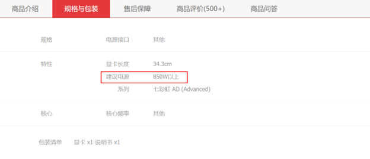

**第二种解法**

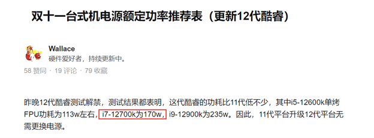

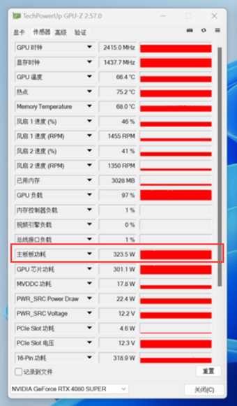

$$170+325+200=695W$$

为了安全起见，推荐 750W 以上电源

我们可以发现，显卡标注的推荐电源余量很大，在正常装机的时候，可以根据公式 2 计算所需电源瓦数，相对更精确，也可以防止浪费预算

### 我需要买什么样的主板？

首先，在预算并不是特别充足，也没有特殊需求的情况下，选择的主板的价格至多与 CPU 价格差不多。例如，如果你选择的 CPU 为 AMD Ryzen™ 7 7800X3D，它的盒装报价为 2400 元左右，那么可以配一块不超过 2400 元的主板，例如售价 2100 元左右的华硕 TUF GAMING X670E-PLUS WIFI，或者 1800 元左右的技嘉 X670E AORUS ELITE AX

其次，一般来说，主板的预算可以低于 CPU 一截，也就是“减预算”。在“减预算”时，注意主板供电是否足够。主板接口是否能安装所有你选择的硬件。例如，还是以 AMD Ryzen™ 7 7800X3D 为例，我们想在 1000 元左右拿下一块足够使用的主板，不要求好的超频性能，只要稳定 PBO 使用即可，那么我们可以将芯片组降级。根据第一大部分中“南桥”一节提到的内容，AMD 的中端芯片组为 B650

在淘宝一阵翻找之后，我们可以发现一块主板：华硕 PRIME B650M-K。此时我们再回到 B 站，搜索 B650M-K 的相关视频，然后可以得出结论：这块主板支持 7700X 及以下的 CPU，并且在搭载 7800X3D 或 7900X 时会出现供电不足的问题。因此，这块主板不能与 7800X3D 搭配使用

再次回到淘宝，我们在稍高的预算段位看到了微星 B650M Mortar，售价 1099 元。这块主板与我们的预算符合。此时在 B 站查找主板测评，发现主板可以稳定带动 PBO 下的 7950X，而 7950X 的功耗显然大于 7800X3D。因此，微星 B650M Mortar 就是我们的合理选择。当然，同价位肯定还有其他主板也符合要求，在此仅为举例，并不代表唯一答案。于是，主板与 CPU 的总价即为 3500 元

下表显示了 Intel 与 AMD 两家的 CPU 系列对应适合搭配的主板芯片组，也可作为参考

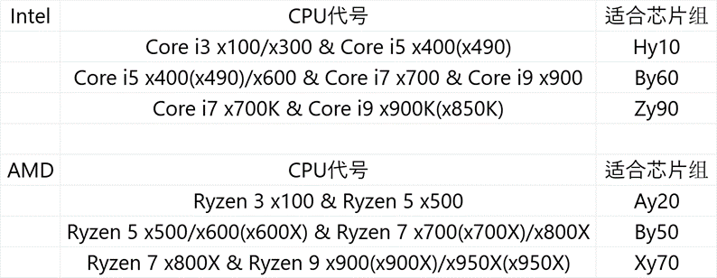  
表中小写字母 x,y 为占位符，表示 CPU 与芯片组的代数。具体某代芯片组支持哪几代 CPU 可以查阅第一大部分的“1.6 南桥”一节，也可以查看主板厂商官网的提供的兼容性报告

另外需要注意，主板的规格决定了选择何种机箱。目前市面上的主板主要可以分为 ATX/M-ATX/E-ATX/ITX 四种规格，并且也有特例——铭瑄 H610 King 背插式主板为 YTX 规格，基本可以看作缩短的 M-ATX 主板，可以与支持背插的 M-ATX 机箱相互兼容。从 EATX 到 ATX 到 MATX 再到 ITX，主板大小依次减小，扩展性依次减弱。ITX 主板专为 ITX 小机箱设计，可以用它组装出便携式的 ITX 主机；M-ATX 为比较流行的主板规格，扩展性尚可，与 M-ATX 机箱、ATX 机箱兼容，可以组装出比较小的桌面主机；ATX 为标准主板规格，比 M-ATX 略大，兼容 ATX 机箱，扩展性也比较好，但是不能装进只支持 M-ATX 主板的机箱；E-ATX 规格主要在工作站主机中存在，目前市面上不常见。在购买配件时，一定要检查好主板与机箱的兼容性问题

### 如何从头开始选择自己的组装电脑配置？

如果你成功地看到了这里，了解了以上的所有知识，那么恭喜你，你已经拥有了足够扎实的计算机硬件基础，可以正式来选购自己的主机了！

笔者将以一个例子来分步解析如何选择自己的主机中的所有配件。

假设有一名大二的同学，我们叫他小闻，闻同学的预算是 15000 人民币以内（仅包含主机），要求能以 2K 高画质高帧率畅玩《Apex》《PUBG》等 FPS 游戏，平时也会玩一玩《赛博朋克 2077》等主机游戏。在此之外，闻同学还对深度学习有兴趣，希望主机拥有相对不太弱的深度学习计算能力。如果能具有 ARGB 光效，使得整机外观更好看就更好了。另外，闻同学希望主机的整体颜色是黑色的

接下来我们来分析如何根据预算选择合适的硬件：

1. 闻同学的主诉求是网游，网游相比显卡，更依赖 CPU 与内存，又因为闻同学的整体预算并不低，因而我们首先以 1:3-1:4 左右的预算分配给 CPU 与显卡（见章节 2.1）

2. 闻同学希望主机可以跑一些中小型的深度学习模型，因此必须为 N 卡（见章节 1.5），并且最好有超过 12G 的显存空间

3. 这时我们将预算的 15000 元中分出 3750 元（也就是约 25%）给机箱、散热器。电源、内存、硬盘五大件，将剩下的 11250 元（也就是约 75%）给 CPU、显卡、主板。这个分配比例无论预算多少基本是恒定的。（预算很高或很低除外）

4. CPU 与主板最多为 1:1 的预算比（见章节 2.4），也就是（CPU+主板）:显卡=2:3 至 1:2。因此，我们有 11250\*2/5=4500 元的 CPU+主板的共同预算，以及 6750 元的显卡预算

5. 我们在淘宝等电商平台在 4500 价位段筛选适合游戏的 CPU+主板的配置，可以发现，比较合适的仍然是 7800X3D 这块 CPU。AMD Ryzen™ 7 7800X3D+华硕 TUF B650-PLUS WIFI 的配置，分销商给出的套装价格为 3999 元

6. 由于板 U 没有花完全部预算，显卡的预算调整至 6750+500=7250。在这个价位上的是 RTX 4070Ti Super，是一张兼顾 2K 与 4K 的显卡，并拥有 16G 显存，足以应对不是特别大的的深度学习模型。为了兼顾整机颜值，我们选择同为 TUF 系列的华硕 TUF RTX4070Ti SUPER O16G，分销商售价 6999 元

7. 现在板 U 卡共计花费 11000 元，剩下的 4000 元预算应对五小件绰绰有余。首先是散热器，7800X3D 在正常使用的前提下使用双塔风冷即可，但是为了美观可以选择低价位的 360 一体水冷代替，价格并不会高太多。目前主流单塔四热管散热器的价格在 60-100 元不等，双塔六热管则在 100-250 元不等；240 一体式水冷的价格在 250 元左右；360 一体式水冷的价格则在 300-750 元。由于 7800X3D 的发热量无需使用高端水冷，这里我们选用了质保与漏液险时间比较长的利民 Frozen Warframe 360 ARGB 带屏水冷的黑色版本，拼多多第三方售价 439 元

8. AMD 七代锐龙 CPU 对应的 DDR5 内存条的最佳频率为 6000Mhz，因此在这里我们只需随便选择两条外观喜欢的正规品牌的 DDR5-6000/6400 内存条即可。为了与主板、散热器、显卡的外观契合，这里选择两条使用海力士 A-Die 颗粒的阿斯加特 TUF 联名灯条，参数为 DDR5-6400CL32，容量 16GB\*2，拼多多第三方售价 728 元

9. 电源方面，选择一个带原生 ATX 3.0 标准（因为显卡是 16pin 供电）的 850w 电源即可。（见章节 2.3）这里选择航嘉 MVP K850 850w 电源。（航嘉、长城、鑫谷三家的电源都只需遵循碰高端不碰低端的原则即可，它们虽然低端产线经常有各种问题，但高端线质量还不错）拼多多第三方售价 606 元

10. 硬盘选择一块宏碁 GM7 2TB NVME M.2 固态硬盘。这块硬盘与致钛 Tiplus7100 同方案，几近“换皮版本”，市场反响良好。硬盘的拼多多第三方售价 718 元

11. 机箱选择联力包豪斯 O11D 无立柱版本。这款机箱目前处于供过于求的处境，各大经销商价格都很便宜。第三方售价 515 元。（实际上，机箱看审美选即可，超过百元级别的大品牌箱子目前都极少有质量问题）另外，额外选配六把利民 C12B-S V3 机箱风扇组建风道以及提供 ARGB 光源，共计 136 元。至此，所有硬件全部选择完毕

12. 选完以上硬件后，预算剩余 860 元。这些剩余的预算并不够用来升级 CPU 或显卡，但考虑到选择的配件是一块扩展性比较好的 ATX 主板，剩余的预算可以为整机增加一块 M.2 系统盘。于是，可以选购一块 WD SN850X 1T 作为系统盘，第三方售价 569 元

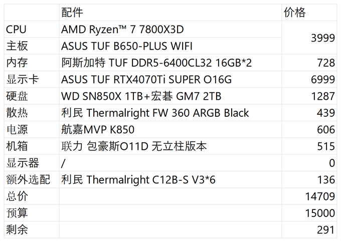

以上就是选择配件的全部思路，如切分蛋糕一般，将配件预算有所规划，多退少补，灵活查阅各家平台报价，货比三家

## 结语
