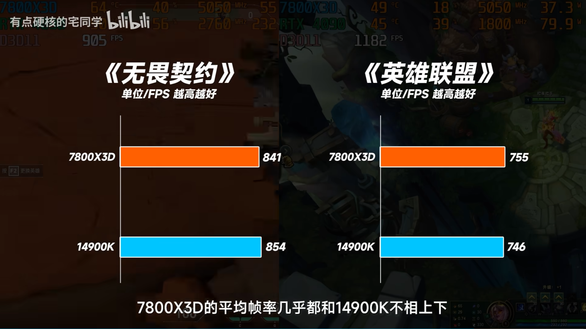
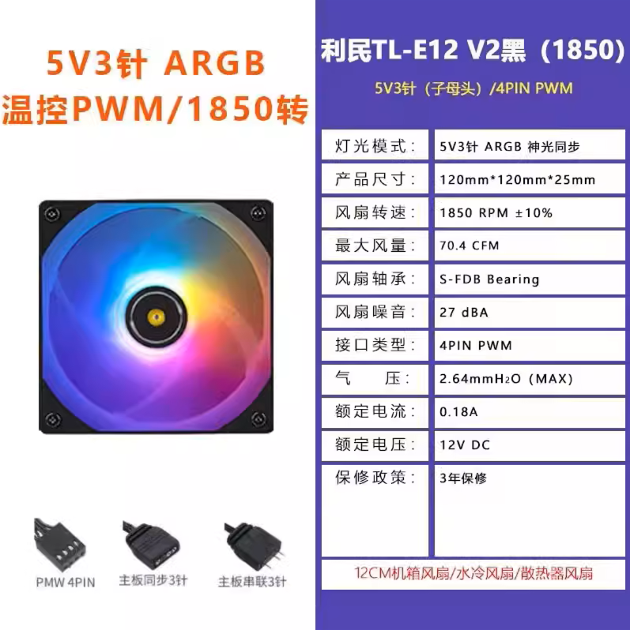

- [版权声明](#版权声明)
- [更适合大学生的硬件选择导论（二）](#更适合大学生的硬件选择导论二)
	- [DIY PC 硬件选择原理与方法](#diy-pc-硬件选择原理与方法)
		- [论 CPU 和显卡的预算分配](#论-cpu-和显卡的预算分配)
		- [买 Au 还是 Iu？](#买-au-还是-iu)
		- [买 A 卡还是 N 卡？](#买-a-卡还是-n-卡)
		- [我要买哪款主板？](#我要买哪款主板)
		- [我要买怎样的内存？](#我要买怎样的内存)
		- [我得买怎样的固态硬盘？](#我得买怎样的固态硬盘)
		- [我要买机械硬盘吗？](#我要买机械硬盘吗)
		- [我要买什么 CPU 散热？](#我要买什么-cpu-散热)
		- [我需要多大的电源？](#我需要多大的电源)
		- [机箱与风扇](#机箱与风扇)
		- [如何从头开始选择自己的组装电脑配置？](#如何从头开始选择自己的组装电脑配置)

# 版权声明

本作品适用 Creative Commons Attribution 4.0 International License 版权协议。  
This file is licensed under the Creative Commons Attribution 4.0 International license.

LICENSED BY: CC-BY-NC-SA

**您可以做的**

1. 您（用户）可以复制、发行、展览、表演、放映、广播或通过信息网络传播本作品；您必须按照作者或者许可人指定的方式对作品进行署名
2. 您可以自由复制、散布、展示及演出本作品；若您改变、转变或更改本作品，仅在遵守与本作品相同的许可条款下，您才能散布由本作品产生的派生作品

**您需要遵守的**

1. 您不得为商业目的而使用本作品
2. 署名必须包含“最大限度的信息”。 一般来说，这意味着：

- 包含任何版权声明（如适用）。如果作品自身带有作者的版权声明，版权声明必须保持不变，或在一种合理的方式下重新分发给媒介
- 引用作者的名字，网名或用户 ID 等。如果作品发布在互联网上，如果存在作者的个人档案页面，应附上页面的链接
- 引用作品的标题或名称（如适用），前提是存在标题或名称。如果作品发布在互联网上，应在重新分发时连接到原作品的标题或者名称
- 引用作品的 CC 许可协议。如果作品发布在互联网上，应引用作者的 CC 许可协议，且应附有到 CC 网站的链接
- 如果作品是一个派生作品或改编作品，除了以上几点外，还应该说明这是一个派生作品

如果对该协议含义或细节产生疑问，请访问  
https://creativecommons.org/licenses/by-nc-sa/4.0/legalcode  
如果您访问该网站时遇到困难，也可以访问  
https://blog.csdn.net/jiangyu1013/article/details/80649774

# 更适合大学生的硬件选择导论（二）

## DIY PC 硬件选择原理与方法

### 论 CPU 和显卡的预算分配

在新世纪初前后的十余年内，CPU 一直是整机预算配置的重中之重。2003 年前后，笔者家购买的主机配置中最耀眼的“头号人物”，便是在当时售价（即使今日的物价在对比当时时受到通货膨胀的极大影响）与如今的 i7-12700KF 几乎相同的 Intel Pentium 4 处理器，拥有在当时难以想象的最高 3.8 GHz 加速频率与一条 QDR FSB 总线，计算性能在当时遥遥领先

但是自从各类 3A 主机游戏开始发展，很多人发现，自己比想象中更需要一款强大的支持 3D 渲染加速的显卡。由 Nvidia 带领的 GPU 革命从此将用户的预算从“升级 CPU”向“显卡与 CPU 达成预算平衡”的方向拉动。2013 年底，Nvidia 旗舰显卡 Geforce GTX 780 Ti 推出，价格超过同年顶级消费级桌面端 CPU Intel Core™ i7-4770K，从此，旗舰显卡的价格开始超越旗舰消费级 CPU

在 2024 年的硬件市场上，一个合适的游戏主机搭配已经可以将整机价格一半的预算分给显卡。但是读者中应该不会都是重度的游戏玩家，大部分人装配电脑也是倾向于平衡游戏性能与数据处理和办公性能。因此，并不需要无脑将绝大部分预算花在显卡上。同时，极度的低 U 高显（即用很差的 CPU 搭配很强的显卡）会使得显卡发挥不出应有的性能，反而不利于电脑整体性能的提高

具体的 CPU 和显卡搭配可以参考以下建议：

**对于游戏玩家**，即更加看重计算机的影音性能与游戏性能的用户，其 CPU 与显卡的预算分布最高可以上调至 1:8，但选择显卡价格不要超过选择的 CPU 售价的 8 倍太多。例如，对于游戏玩家用户，如果选择的 CPU 是 Intel Core™ i5-12490F,此款 CPU 的价格约为 900 元，900 \* 6 = 7200 元，则显卡最高可以选择售价在 6500 左右的 RTX 4070 Ti Super。但是，售价约 8500 的 RTX 4080 Super 可能就不适合这款 CPU

**对于希望均衡游戏性能与办公性能的用户**，CPU 与显卡的预算分布最多可以向 1:6 靠近。（当预算充足时这个比值变大，即最多向 1:4 乃至 1:3 靠近）例如，使用一块 800 元左右的 i5-12400F 搭配一块 2800 元左右的 RTX 4060 Ti 8G 显卡是合理的，因为这个配置的 CPU-显卡预算比约为 1:3.5，没有小于 1:6；使用一块 1600 元的 i5-13600KF 搭配一块 8350 元的 RTX 4080 Super 也是合理的，因为这个配置的 CPU-显卡预算比约为 1:5。但是，i5-12400F 搭配 RTX 4080 Super 就不太合理，虽然不一定会出现低 U 高显，但是肯定会使得电脑变成“偏科生”，CPU 性能偏低

**对于预算较低的用户**，优先将部分显卡的预算分出来给 CPU 与内存。因为显卡的性能差距在运行大型游戏时才能体现出来，而 CPU 与内存的选择如果太差，会导致在系统中就感觉卡顿，例如需要多任务并行等环境下。另外，内存太小甚至会导致许多软件根本无法运行。因此，如果预算有限，优先保证 CPU 和内存

### 买 Au 还是 Iu？

注：如果你看不懂这个标题，可以参考上篇文章《更适合大学生的硬件选择导论（一）》中讲解 CPU 的部分

> CPU 与显卡的品牌选择对于新手来说实在是一个头疼的问题，尤其是 CPU。Intel 与 AMD 应当选谁的问题自从 AMD 发布第一代 Ryzen™ 处理器以来，就一直被大家提出。从一代锐龙超强的多核性能使得 AMD 一炮走红，到英特尔十代酷睿性能赶上同期的三代锐龙，再到 AMD 五代锐龙彻底打赢 Intel，随着时间的推移，这个问题的答案在发生周期性变化

> 在 2024 年，AMD 与 Intel 正处于势均力敌的态势。理论上而言，目前选择哪一方都各有优劣，普通用户选择的 CPU 品牌不会对你的主机性能造成决定性影响

**选择 Au**

- AMD 的消费级桌面端 CPU（简称 Au）由于一直采用瞄准对手竞品价格定价的策略，价位和性能的对应关系比较明确 —— 7500F < 7600 < 7600X < 7700 < 7700X < 7800X3D < 7900 < 7900X < 7900X3D < 7950X < 7950X3D。每款 Au 多核性能一般都强于 Intel 在同一价位的竞品，都非常有性价比

- Intel 的消费级桌面端 CPU（简称 Iu）在全系性价比略低于 Au 的情况下，其主流在产产线 12/13/14 代鱼龙混杂，隔代产品之间提升不大（尤其是 13 与 14 代），市场价也比较混乱。例如 Core™ i5-14400F 正处于一个高价低能的状态，性能弱于 12600KF 的同时，价格比起后者居然更贵。因此选购 Iu 务必仔细对比性能天梯图与售价

- 酷睿 12 代及以后的 Iu 具有大小核心设计。非常不妙地，早期版本的 Windows 10 在调度大小核上从没有过优化，因此导致 Intel 的 12 代及以后的处理器（除了不具备小核的几款，例如 12400F）硬性要求安装 Windows 11 系统。对于想要保留 Windows 10 系统的人来说，可能更推荐 AMD

**选择 Iu**

- Iu 目前仍然占据着顶级消费级桌面端 CPU 榜首。Core™ i9-13900KS 与 Core™ i9-14900K 双双打赢 7950X 登顶 CPU-Z 与 Cinebench 性能榜，因此目前顶配主机还是只有 14900K + RTX4090 一种选择

- Au 的内存兼容性并不理想，在 B650 与 X670 主板旧版本 BIOS 的情况下，AMD 对除了海力士 (Hynix) A-Die 颗粒以外的内存具有奇怪的兼容性，例如海力士 M-Die ，可能上一批颗粒在相同参数下能开机，而这一批就不行，造成 **内存不兼容 —— 无法开机 —— 无法刷新 BIOS —— 无法兼容内存 —— 无法开机** 的尴尬境况。这种情况在部分内存厂商，如阿斯加特或金百达等品牌对内存刷写的 spd 信息错误时也可能出现

- AMD 的 PBO2 超频选项作为释放 Au 全部能力的必备条件，其操作仍过于繁琐，比 Iu 睿频技术而言更难上手

- AMD 的 7000 系 Ryzen™ 只支持 DDR5 内存，比起 Intel 同时支持两代内存（需要根据主板而定）来说，可能会增加预算（现在的 DDR4 内存条真是白菜价）

- 如果你是重度 FPS 或网游用户，那就投身 AMD 神教吧，Ryzen™ 7 7800X3D 将是目前性价比最高的专为 FPS 与网游设计的高帧率游戏 CPU，甚至在网游方面几乎不弱于 14900K

### 买 A 卡还是 N 卡？

显卡方面呢？虽然目前 Nvidia 的显卡技术比 AMD 和 Intel 加起来还强得多，但中低端 Nvidia 的消费级显卡（俗称 N 卡）和 AMD 的消费级显卡（俗称 A 卡）的性价比差距并不大。在低端卡上，购买同价位 A 卡很可能带来更高的性能表现。但高端乃至顶级消费级显卡上，N 卡则是垄断态势

如果你的显卡预算低于 4000 且对光追没有特别高需求，我非常推荐你购买 AMD 的显卡，例如 RX 6600 或 RX 6750 GRE；如果你的显卡预算在 6000-8000，那么购买 AMD 的 RX 7900 XTX 以体验极致的光栅化性能或购买 RTX 4070 Ti 或 RTX 4070 Ti Super 以享受光线追踪技术和强大的 DLSS 3.0 都是可行的方案。8000 元以上，只有 RTX 4080、RTX 4080 Super、RTX 4090 可选

另外有一个值得注意的点：4K 240Hz oled 显示器即将上市，而 40 系 N 卡仍然只支持 dp1.4 接口。对于想以 4K 240Hz 游玩网游的玩家，也可以考虑支持 dp2.1 接口的 RX 7900 XTX 显卡

特殊情况是当你需要 CUDA 单元的时候。如果你的预算比较低，又想购买一张显卡用于深度学习或炼丹（Stable Diffusion 等），那么这个时候可以选择 RTX 4060 Ti 16GB 版本，价格约 3000 元

### 我要买哪款主板？

在预算并不是特别充足，也没有特殊需求的情况下，选择的主板的价格应当至多与 CPU 价格差不多。例如，如果你选择的 CPU 为 AMD Ryzen™ 7 7800X3D，它的盒装报价为 2400 元左右，那么可以配一块不超过 2400 元的主板，例如售价 2100 元左右的华硕 TUF GAMING X670E-PLUS WIFI，或者 1800 元左右的技嘉 X670E AORUS ELITE AX

其次，一般来说，主板的预算可以低于 CPU 一截，也就是“减预算”。在“减预算”时，注意主板供电是否足够。主板接口是否能安装所有你选择的硬件。例如，还是以 AMD Ryzen™ 7 7800X3D 为例，我们想在 1000 元左右拿下一块足够使用的主板，不要求好的超频性能，只要稳定 PBO 使用即可，那么我们可以将芯片组降级。

参考上篇文章《更适合大学生的硬件选择导论（一）》中讲解南桥的部分，AMD 的中端芯片组为 B650。我们可能会首先找到一块价位合适的主板：华硕 PRIME B650M-K。此时我们再搜索 B650M-K 的相关评测，可以得出结论：这块主板支持 7700X 及以下的 CPU，并且在搭载 7800X3D 或 7900X 时会出现供电不足的问题。因此，这块主板不适合与 7800X3D 搭配使用

再回到购物平台，我们在稍高的预算段位看到了微星 B650M Mortar，售价 1099 元。这块主板与我们的预算符合。此时在 B 站查找主板测评，发现主板可以稳定带动 PBO 下的 7950X，而 7950X 的功耗显著大于 7800X3D。因此，微星 B650M Mortar 就是我们的合理选择。当然，同价位肯定还有其他主板也符合要求，在此仅为举例，并不代表唯一答案。于是，主板与 CPU 的总价即为 3500 元

上图为 Iu 与 Au 对应适配的主板芯片组。表中小写字母 x, y 为占位符，表示 CPU 与芯片组的代数。具体某代芯片组支持哪几代 CPU 可以参考上篇文章中讲解南桥的部分，也可以查看主板厂商官网提供的兼容性报告

另外需要注意，主板的规格决定了选择何种机箱。目前市面上的主板主要可以分为 ATX/M-ATX/E-ATX/ITX 四种规格，并且也有特例——铭瑄 H610 King 背插式主板为 YTX 规格，基本可以看作缩短的 M-ATX 主板，可以与支持背插的 M-ATX 机箱相互兼容。从 E-ATX 到 ATX 到 M-ATX 再到 ITX，主板大小依次减小，扩展性一般而言依次减弱

ITX 主板专为小机箱设计，主要用于组装便携式迷你主机；M-ATX 是比较流行的主板规格，扩展性尚可，兼容 M-ATX 和 ATX 机箱，可以组装出比较小的桌面主机；ATX 为标准主板规格，比 M-ATX 略大，兼容 ATX 机箱，扩展性很好，但是不能装进只支持 M-ATX 主板的机箱；E-ATX 规格主要在工作站主机中存在，目前市面上不常见。在购买配件时，一定要检查好主板与机箱的兼容性问题

### 我要买怎样的内存？

目前市场上主流内存分为 DDR4 和 DDR5 两种，它们互不兼容，选购内存前需要先确定你选择的 CPU 支持的内存代数，并根据 CPU 和内存选择主板。DDR4 已经处于发展末期，频率更高的 DDR5 刚起步不久，它们互有优劣

目前 DDR4-3600CL18 16G\*2 带有散热马甲的内存条的价格大约在 450 元左右，DDR5-6000CL36 采用海力士 M-Die 颗粒的 16G\*2 马甲条的价格大约在 600 元左右，差价 150 元左右

可选 DDR4 与 DDR5 的平台主要为 Intel 的 600 系和 700 系芯片组，如 H610、B760、Z790 等。12/13/14 代 Core™ 处理器对内存频率的需求都比较大，在均为 DDR5 内存的状态下，不同内存频率下的 Core™ i9-13900K 的性能表现都会大相径庭

因此，当预算比较低时（例如 4000 ~ 5000 价位），如果要选用 Intel 平台，推荐选择 DDR4 内存。其他情况下推荐选择 DDR5 内存以获取更好的性能表现

对于目前支持 DDR4 代内存的 12 代 Core™ 处理器，其 DDR4 内存控制器的设计已经非常成熟了。因此，例如 12400F 这种 CPU 推荐购入（如果确定了使用 DDR4 主板）DDR4-3200 频率内存条，推荐品牌为嘉合劲威（阿斯加特、光威、威刚）与宏碁等，当然例如芝奇、宇瞻、影驰 HOF 系列等也为很好的选择

对于目前支持 DDR5 代内存的 12/13/14 代 Intel CPU，推荐使用的内存条频率根据主板、CPU 的选择而定。例如运行在 B760 主板上的 13600K 等 CPU，可以选择 DDR5-6400 频率内存条。当然，如果希望尝试更高的内存频率，也可以使用标称达 7200 Mhz 内存频率的主板搭配使用海力士 A-Die 颗粒的 DDR5-6800 内存,因为海力士 A-Die 和 M-Die （尤其是 A-Die）是目前最优质的内存颗粒。如果使用的是 13900K 等高端处理器搭配 Z790 主板，则可以考虑选择使用海力士 A-Die 颗粒的 DDR5-6800 或 DDR5-7200 内存条，例如宏碁掠夺者 Vesta II 系列；亦可以使用海力士新 M-Die 颗粒的 DDR5-6800 或 DDR5-7200 内存条，如光威天策系列。海力士新 M-Die 的识别特征为内存条容量是 3 的倍数，如 24G 单条的内存条，一般使用的是新 M-Die 颗粒

对于目前只支持 DDR5 内存的 AMD Ryzen™ 7000 系列处理器，内存频率的选择就得保守得多。7500F 到 7700X 间的中低端处理器推荐购买 DDR6-6400 频率以下的海力士 A-Die 颗粒内存条，在 BIOS 中开启 XMP 后降频至 5600-6000 Mhz 使用；7800X3D 到 7950X3D 间的高端处理器推荐购买 DDR5-6800 频率以下的海力士 A-Die 颗粒内存条，并且开启 XMP 后使用（如果购买了 6800 Mhz 的内存条，仍然推荐手动降频至 6400 Mhz 及以下）

以上建议只针对安装单面内存条时的情况，其特例为使用双面内存条。双面内存条的识别方法一般为容量，目前大于等于 32G 单条的 DDR5 内存条为双面内存条。在使用双面内存条时，推荐频率比单面至少低 400 Mhz。这是因为双面内存条的 PCB 两侧均有内存颗粒，PCB 布线比较复杂，信号稳定性比单面内存条有所下降

**内存容量的选择**

纯游戏/办公/轻度数据处理与 Adobe 套件使用：16G 及以上  
需要使用 Adobe 套件或需要使用达芬奇等视频流处理软件：32G 及以上  
需要使用 MATLAB 等工具运行较大型的科学计算任务：48G 及以上，多多益善

目前使用 DDR5 内存条时，不推荐插满主板上的四个内存槽以增加内存容量。当然如果你的主板只有两个内存槽，那就不会遇到这个问题

这是因为目前的 CPU 至四内存插槽的布线是并线设计，CPU 内的每个内存通道在主板上负责控制两个内存槽，两根内存之间的信号线为并联关系。因此，当插满四根内存条时，每个内存通道会有两根内存一起存取数据，对主板布线与 CPU 内存控制器压力显著增加，导致实际可以使用的内存频率大大下降，甚至无法保证在 5600 Mhz 频率下正常开机使用。因此，DDR5 内存条推荐只安装两条（安装至主板 2、4 内存插槽）

### 我得买怎样的固态硬盘？

对于纯游戏（尤其是 FPS 玩家）主机玩家而言，1t 固态硬盘存储空间基本足够。如果玩的游戏比较没有稳定性，想尝试不同的游戏，可能会同时下载数十个 3A 游戏，那么推荐使用 2t 固态硬盘存储空间

如果具有视频流任务，需要将固态硬盘作为缓存存储需要使用的一些视频资源，则需要的固态硬盘容量可能更大，推荐使用 1t 系统盘 + 2t 仓储盘起步，另外推荐使用机械硬盘储存大量冷数据（不常用但仍需要保留的视频资源），此时应当购买 4t 以上的机械硬盘（4t 及以下的机械硬盘性价比优势非常小）

要详细了解固态硬盘的选购策略可参考上篇文章 [原厂盘与非原厂盘的区别](./硬件科普.md#nvme-m2-固态硬盘) 部分。目前市面上常见的 NVMe 固态硬盘主要有 PCIe 3.0 协议与 PCIe 4.0 协议两种，在使用时可以根据主板 M.2 插槽支持的 PCIe 协议购买，硬盘支持的 PCIe 版本号最好不要高于主板插槽支持的 PCIe 版本号，否则容易导致性能损失。支持 PCIe 4.0 协议的固态硬盘会具有相对更快的顺序读取速度（满速 7000 MB/s 以上），但价格更贵

以下是一些固态硬盘的推荐（具有时效性，针对 2024 年年初，在之后可能需要参考新产品的评测）：

**低预算** **系统盘** 铠侠 SD10，宏碁 GM7/GM7000，威刚 S70 SE **仓储盘** 致钛 Tiplus5000，铠侠 RC20

**高预算** **系统盘** 西数 SN850X，Solidigm P44 Pro，威刚 S70 Blade，海力士 P41（注意不是 Solidigm P41 Plus），三星 990 Pro/980 Pro **仓储盘** 西数 SN770/SN570/SN580，宏碁 GM7，致钛 Tiplus7100，威刚 S70 SE

### 我要买机械硬盘吗？

**是否需要购买机械硬盘取决于你是否真的有大量数据储存需求，事实上，大部分人并不需要。**

机械硬盘的随机读写性能远远落后于固态，但顺序读写没有落后太多。这意味着，机械硬盘在存储视频、照片、单个 Word/PDF 等文档等不吃随机读写性能的文件时，加载速度没有落后固态太多。而且，机械硬盘的容量通常远大于同价位的固态硬盘，比如一块 4t M.2 固态的价格通常就高于一块 8t 的机械。同时，机械硬盘作为文件备份硬盘的可靠性高于固态硬盘，即使损坏，数据也大概率可以恢复，而损坏的固态硬盘内的数据则极难恢复

因此，如果你有大量重要文件需要备份，或是一位视频工作者，那么你仍然有购买机械硬盘的需要。关于推荐购买的机械硬盘，可以参考 B 站 UP [钱韦德](https://space.bilibili.com/20274090)

### 我要买什么 CPU 散热？

**这取决于 CPU**

对于 Iu，Core™ i5-13400 及以下的 CPU 均只需要单塔四热管风冷散热器即可，这类散热器一般价格在 100 元以内；13600K 需要双塔六热管风冷散热器或是 240 规格的水冷散热器，13700K、14700K 等 CPU 在默频下需要 240 规格的水冷散热器，在超频模式下需要 360 规格的水冷散热器；13900K、13900KS 与 14900K 则需要 360 水冷散热器起步

对于 Au，Ryzen™ 5 7500F 与 7600 在 A620 与 B650 芯片组主板上需要单塔四热管风冷散热器，7800X3D 等 CPU 在 B650 芯片组主板上需要双塔六热管风冷散热器；而如果使用的是在 X670E 芯片组主板上开启了 PBO 的 7800X3D，则至少需要性能稍好的 240 水冷（廉价 240 水冷难以为开启了 PBO 的 7800X3D 提供足够的散热）；7900X 与 7950X 以及这两颗 CPU 的 X3D 版本均推荐搭配 360 水冷散热器

### 我需要多大的电源？

**方式一** 根据显卡页面标注推荐电源（通常远高于实际所需电源大小）

  
翻阅心仪显卡的参数页面后选购电源。这是最简单的方式，但是这种方式通常会有点浪费预算

**方式二** 将 CPU 和显卡的最大烤机功耗相加后再加 150 ~ 200w

170 + 325 + 200 = 695W。因此选择 700w 以上电源

### 机箱与风扇

机箱可以根据自己的预算、喜欢的外观与选择的主板大小决定。一般而言，ITX 机箱支持 ITX 规格主板（部分结构的 ITX 机箱可能会支持 M-ATX 主板），M-ATX 机箱支持 M-ATX 主板，ATX 机箱支持 M-ATX 与 ATX 两种规格的主板，E-ATX 机箱支持 E-ATX、ATX 与 M-ATX 三种规格的主板（虽然绝大部分机箱都支持 ITX 规格的主板，但通常不会将 ITX 主板装在大规格机箱里）

风扇的选择主要考虑以下三个因素：

**散热需求** 推荐至少确保一把风扇用于机箱尾部出风，这能极大优化机箱风道。其他的风扇位是否装扇按需选择

**主板接口** 由于 CPU 散热器至少使用一个风扇接口（与一个 RGB 接口），主板上是否有额外的足够多的风扇四针 PWM 接口与 ARGB 接口来为选配的风扇供电？当然，有些风扇具有并联 RGB 与 PWM 线，当几个这样的风扇互相并联时，可以只占用一个 PWM 接口。（与一个 RGB 接口）一般推荐一根串联 PWM 线上不得超过 4 把 12 cm 风扇，否则易导致主板 PWM 接口过载。实在有使用一个接口为多数风扇供电的需求时，可以购买使用 SATA 供电接口的风扇 PWM 集线器

**风压平衡** 机箱风扇在机箱内有进、出风两种功能，扮演这两种功能的风扇所需的设计是不同的，进风风扇需要较大的风压，而出风风扇则需要较大的风量

如上图是电商平台某详情页中利民 TL-E12V2-B ARGB 风扇的参数，其中我们需要关注的是风量与风压两项。一把足够用于散热器的 12 cm 风扇，其性能参数必须满足：风压超过 2.0 mm 水柱（约 20 Pa）的同时，风量大于 60 CFM。而对于机箱风扇，要求可降低一些：进风扇的风压要求超过 1.8 mm 水柱（约 18 Pa），出风扇的风量要求超过 50 CFM

**机箱风道** 如果在特定风扇转速环境下，机箱进风扇吸入的总风量小于出风扇排出的总风量，则称这样的机箱风道为 **负压风道**，反之则为 **正压风道**；如果进出风量基本相等则为 **平衡风道**。在相同的环境下，负压风道散热能力最弱，平衡最强，正压其次；负压风道积灰最严重，平衡其次，正压积灰最慢；以上情况在随着总风量增大而更显著。因此请尽可能避免进出风扇搭配后形成负压风道

### 如何从头开始选择自己的组装电脑配置？

如果你成功地看到了这里，了解了以上的所有知识，那么恭喜你，你已经拥有了足够扎实的计算机硬件基础，可以正式来选购自己的主机了！笔者将举一个例子分步解析如何选择自己的主机中的所有配件

小闻同学的预算是 15000 人民币以内（仅主机不含外设），要求能以 2K 高画质高帧率畅玩《Apex》《PUBG》等 FPS 游戏，平时也会玩一玩《赛博朋克 2077》等单机游戏。在此之外，闻同学还对深度学习有兴趣，希望主机拥有相对不太弱的深度学习计算能力。如果能具有 ARGB 光效，使得整机外观更好看就更好了。另外，闻同学希望主机的整体颜色是黑色的

接下来我们来分析如何根据预算选择合适的硬件：

1. 闻同学的主诉求是网游，网游相比显卡，更依赖 CPU 与内存，又因为闻同学的整体预算并不低，因而我们首先以 1:3 ~ 1:4 左右的预算分配给 CPU 与显卡（见章节 2.1）

2. 闻同学希望主机可以跑一些中小型的深度学习模型，因此必须为 N 卡（见章节 1.5），并且最好有超过 12G 的显存空间

3. 这时我们将预算的 15000 元中分出 3750 元（也就是约 25%）给机箱、散热器。电源、内存、硬盘五大件，将剩下的 11250 元（也就是约 75%）给 CPU、显卡、主板。这个分配比例无论预算多少基本是恒定的（预算极高或极低情况下除外）

4. CPU 与主板的预算分配最少达到 1:1（见章节 2.4），也就是 板 U : 显卡 = 2:3 ~ 1:2。因此，我们有 11250 \* 2 / 5 = 4500 元的板 U 预算，以及 6750 元的显卡预算

5. 我们在淘宝等电商平台在 4500 价位段筛选适合游戏的板 U 配置，可以发现，比较合适的仍然是 7800X3D 这块 CPU。AMD Ryzen™ 7 7800X3D + 华硕 TUF B650-PLUS WIFI 的配置，分销商给出的套装价格为 3999 元

6. 由于板 U 没有花完全部预算，显卡的预算调整至 6750 + 500 = 7250。在这个价位上的是 RTX 4070 Ti Super，2K 和 4K 都适用，显存 16G，足以应对小规模的深度学习模型。为了兼顾整机颜值，我们选择同为 TUF 系列的华硕 TUF RTX 4070 Ti Super 16G，分销商售价 6999 元

7. 现在板 U 卡共计花费 11000 元，剩下的 4000 元预算应对五小件绰绰有余。首先是散热器，7800X3D 在正常使用的前提下使用双塔风冷即可，但是为了美观可以选择低价位的 360 一体水冷代替，价格并不会高太多。目前主流单塔四热管散热器的价格在 60 ~ 100 元，双塔六热管在 100 ~ 250 元；240 一体水的价格在 250 元左右；360 一体式水冷的价格则在 300 ~ 750 元。由于 7800X3D 的发热量无需使用高端水冷，这里我们选用了质保与漏液险时间比较长的利民 Frozen Warframe 360 ARGB 带屏水冷的黑色版本，拼多多第三方售价 439 元

8. AMD 七代锐龙 CPU 对应的 DDR5 内存条的最佳频率为 6000 Mhz，因此在这里我们只需随便选择两条外观喜欢的正规品牌的 DDR5-6000/6400 内存条即可。为了与主板、散热器、显卡的外观契合，这里选择两条使用海力士 A-Die 颗粒的阿斯加特 TUF 联名灯条，参数为 DDR5-6400CL32，容量 16G\*2，拼多多第三方售价 728 元

9. 电源方面，选择一个带原生 ATX 3.0 标准（因为显卡是 16 pin 供电）的 850w 电源即可（见章节 2.3）。这里选择航嘉 MVP K850 850w 电源（航嘉、长城、鑫谷三家的电源需遵循不碰低端的原则，它们高端线质量过得去单低端产线经常有缩水等问题）拼多多第三方售价 606 元

10. 固态硬盘选择一块宏碁 GM7 2t。这块硬盘与致钛 Tiplus7100 同方案，几近“换皮版本”，市场反响良好。硬盘的拼多多第三方售价 718 元

11. 机箱选择联力包豪斯 O11D 无立柱版本。这款机箱目前处于供过于求的处境，各大经销商价格都很便宜，第三方 515 元左右（机箱看审美选即可，百元以上大牌机箱极少有质量问题）。另外，额外选配六把利民 C12B-S V3 机箱风扇组建风道以及提供 ARGB 光源，共计 136 元。至此，所有硬件全部选择完毕

12. 选完以上硬件后，预算剩余 860 元。这些剩余的预算不够用来升级 CPU 或显卡，但考虑到选择的配件是一块扩展性比较好的 ATX 主板，剩余的预算可以为整机增加一块 M.2 系统盘。于是，可以选购一块西数 SN850X 1t 作为系统盘，第三方 569 元

以上就是选择配件的全部思路，如切分蛋糕一般，将配件预算有所规划，多退少补，灵活查阅各家平台报价，货比三家
